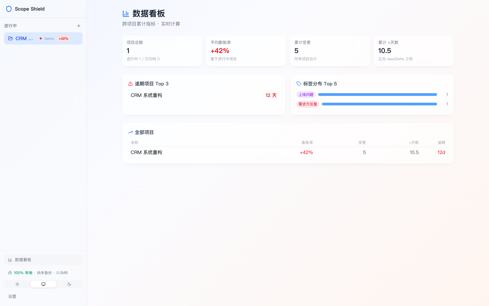
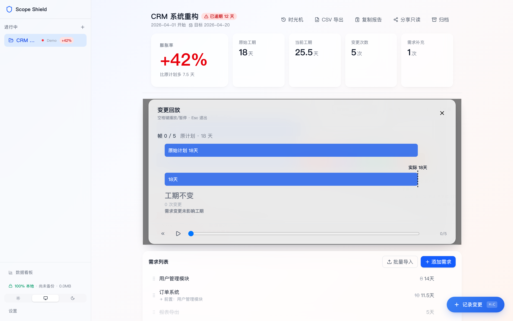
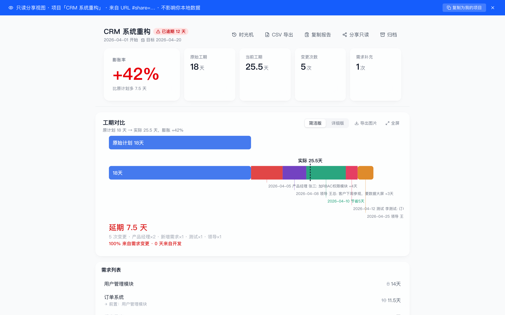
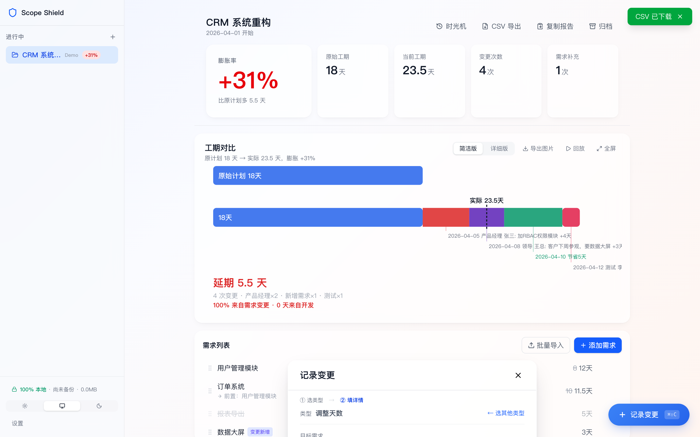
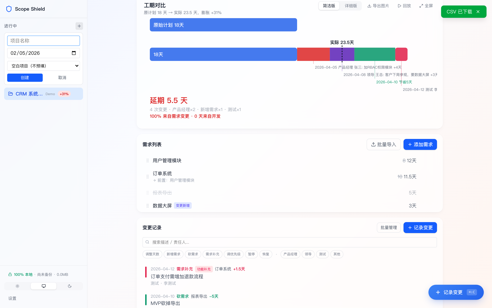
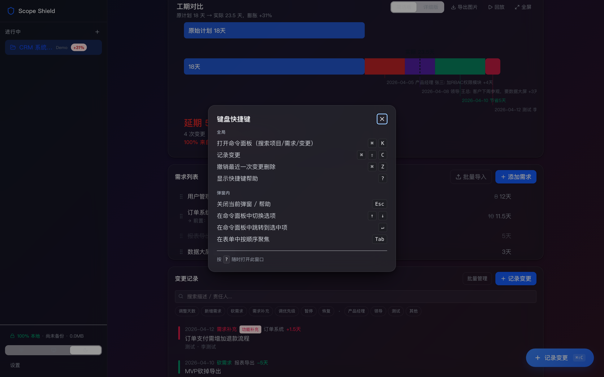
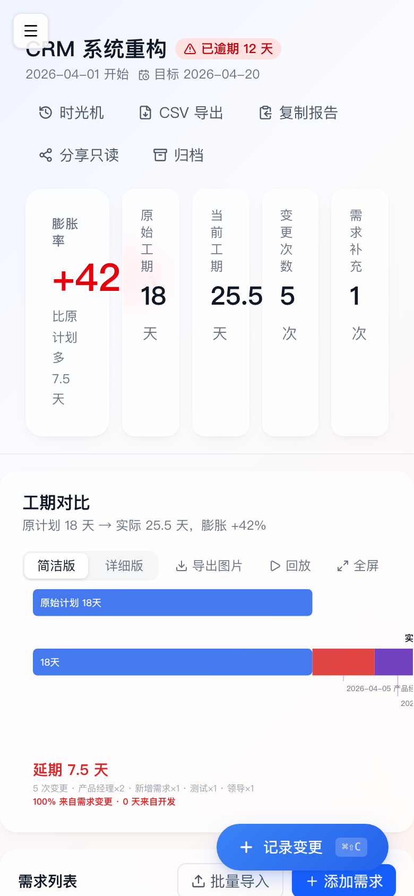

<div align="center">

# 🛡️ Scope Shield

### 让每一次需求加 / 改 / 砍 / 重排都肉眼可见

**100% 本地、零账号、零云同步的项目范围膨胀可视化工具**

[](https://github.com/MrHulu/scope-shield/stargazers)
[](LICENSE)
[](src)
[](https://react.dev)
[](https://vitejs.dev)

[**English**](#english) · [**功能**](#-核心能力) · [**截图**](#-亮点截图) · [**快速开始**](#-30-秒开跑) · [**路线图**](#%EF%B8%8F-roadmap--已交付-5-波-45-项)

</div>

---

> **每次复盘都问"为啥这个项目延期了？"——但没人能说清，因为没人记录原计划是什么。**

Scope Shield 把项目从立项到交付的每一次需求加 / 改 / 砍 / 重排，都画成**原计划 vs 现状对比条 + 甘特时间线**，让 scope creep 第一时间被人看见。所有数据 100% 本地，没有 SaaS 卖你订阅、没有云端读你项目、没有 analytics 上报。一个浏览器标签 + 一个 IndexedDB，就是全部。



> **跨项目数据看板**：5 个项目并行管理时，平均膨胀率 +42%、逾期 Top 1、标签 Top 5 一眼看清。这是 Wave 5 新增的"从工具进阶为平台"能力。

---

## 🏆 为什么有人会 star 这个项目？

| 维度 | Scope Shield | Notion / Jira / Linear / Asana |
|------|--------------|--------------------------------|
| **范围膨胀对比** | ✅ 原计划 vs 现状对比条 + 膨胀百分比 | ⚠️ 只有当前快照，丢失原始基线 |
| **变更归因可视化** | ✅ 7 类变更 + 截图证据 + 责任人 + 标签 | ⚠️ 散落在评论 / 群聊 / 邮件里 |
| **跨项目 Analytics** | ✅ 平均膨胀率 / 逾期 Top 3 / 标签 Top 5 | ⚠️ 多数要付费版才解锁 |
| **零账号 · 零云端** | ✅ 数据只在你浏览器里 | ❌ 必须注册 + 数据托管在他们服务器 |
| **离线 100% 可用** | ✅ 没网照样跑 | ❌ 大多依赖网络与登录态 |
| **一键只读分享** | ✅ 状态编进 URL fragment，对方打开即看到一样的项目 | ⚠️ 需要邀请 / 加成员 / 付费 seat |
| **变更回放动画** | ✅ 时间轴拖动看每次变更后的工期变化 | ❌ 没有 |
| **飞书集成** | ✅ 粘贴需求 URL 自动同步名 / 工期 / 负责人 | ⚠️ 需要装插件或买 connector |
| **价格** | 🆓 永久免费 + 开源 | 💰 SaaS 订阅 |

> **如果你的项目周期总在膨胀、复盘没人能说清原因、又不想把项目数据交给某个 SaaS 厂商 ——** Scope Shield 就是为你做的。

---

## ✨ 核心能力

### 📊 双图表视图：从一眼看清到深入分析

| 简洁版（对比条） | 详细版（甘特时间线） |
|:---:|:---:|
|  |  |
| 原计划 vs 当前膨胀比例一目了然 | 需求级甘特图 + 变更标注 + 关键路径高亮 |

### ⏯️ 变更回放：把项目漂移做成动画



时间轴拖动 / 自动播放（1.1s/帧）/ 空格暂停 / Esc 退出。每一次变更后的工期变化都能"倒带"重看。

### 🔗 只读分享链接：0 后端协作



把当前项目状态序列化进 URL fragment（`#share=…`），对方打开就看到一样的视图，不影响 ta 本地数据。一键"复制为我的项目"还能 fork 走本地编辑。**真正的 zero-backend 协作。**

### 🏷️ 变更标签 + 跨项目聚合



5 个预设标签（需求方反复 / 技术债 / 上线问题 / 范围扩大 / 其他）+ 自定义。Analytics 页面跨项目聚合 Top 5，老板汇报刚需。

### 🎨 5 个项目模板：一键起步



移动 App 0→1 / SaaS Dashboard / 内部工具 / 数据看板 / E-commerce 后台。每个模板含 6-10 条预填需求 + 完整依赖链。

### 🌒 暗色模式 + 完整快捷键体系



`?` 召唤帮助。`⌘K` 命令面板。`⌘⇧C` 记录变更。`⌘Z` 撤销删除。`g s` / `g d` 跳转。Linear / Notion / Slack 风的全键盘可达。

### 📱 移动端响应式



390×844 不破首屏。Sidebar 自动转抽屉。图表横向滚动。出门也能 review 项目。

### 🛡️ 数据保障：0 静默丢失

| 措施 | 实现 |
|---|---|
| 持久化存储 | `navigator.storage.persist()` 阻止浏览器自动驱逐 |
| 自动备份 | localStorage 双 slot 滚动 + 5s 防抖 + 4MB 上限 |
| 空库恢复 | 重装浏览器后启动检测备份 → 一键恢复对话框 |
| 全量导入导出 | JSON / CSV 双格式，支持飞书 URL 反向同步 |
| Schema 演进 | IndexedDB DB_VERSION migration 框架 |

### 🔄 7 种变更类型：覆盖项目漂移的所有形态

| 类型 | 场景 |
|------|------|
| `add_days` | "再给我加 2 天就好" |
| `new_requirement` | 临时插队的新需求 |
| `cancel_requirement` | 砍掉的需求（保留历史） |
| `supplement` | 同一需求的补充（功能加 / 条件改 / 细节细化） |
| `reprioritize` | 优先级重排，不增减总量 |
| `pause` / `resume` | 暂停 + 恢复（保留剩余天数） |

### 🔗 飞书项目 URL 一键同步

粘贴需求 URL → 自动拉取需求名 / 工期 / 负责人 / 排期日期。支持 `feishu.cn` / `larksuite.com` / `meegle.com` 三域。代理失效自动降级 URL-only。

---

## 🚀 30 秒开跑

```bash
git clone https://github.com/MrHulu/scope-shield.git
cd scope-shield && npm install && npm run dev
# → http://localhost:5173/
```

零依赖部署：浏览器 SPA，不需要数据库、不需要后端、不需要登录。打开就用。

### 想用飞书 URL 一键同步？（可选）

1. 装 [credential-center](https://github.com/MrHulu/credential-center) 或自建 `~/.credential-center/feishu_project_state.json`
2. JSON 含 `cookies` 数组 + `meego_csrf_token`
3. 仅 dev 期生效；生产构建无代理时自动降级 URL-only（仍可正常录入）

---

## 🗺️ Roadmap — 已交付 5 波 / 45 项

每一波结束都有秘书亲测走查（headless Chromium + Playwright）+ 公开报告，详见 [`.review/`](.review/)。

| Wave | 主题 | 落地项 | 走查 |
|:---:|---|:---:|:---:|
| **W1** | 商业级 baseline | 14 项 | 14/14 ✅ |
| **W2** | UX 深化 + a11y | 11 项 | 14/14 ✅ |
| **W3** | 力量用户 + 时光机 | 9 项 | 13/13 ✅ |
| **W4** | 数据生命周期 + 协作 | 9 项 | 17/17 ✅ |
| **W5** | 跨项目平台 | 6 项 | 19/19 ✅ |

**累计**：45 项功能 · 266 unit + e2e 测试 · 5 轮亲测走查全过。

### Wave 6 备选（待社区/Boss 拍板）

- 🌐 国际化（中→英文）
- 📈 Analytics 时间线（按月聚合变更趋势）
- 🗜️ Share URL 加 lz-string 压缩（解决 100+ changes 截断）
- 🚌 Onboarding tour（首次进入的新手引导）
- 📑 PDF 导出（多页 A4 报告）

> 想看到哪个落地？[开 Issue](https://github.com/MrHulu/scope-shield/issues) 或者直接 PR。

---

## 🛠️ 技术栈

| 层级 | 选型 | 版本 |
|------|------|------|
| **运行时 / 类型** | React + TypeScript | 19.2 / ~6.0 |
| **构建** | Vite | 8.0 |
| **样式** | Tailwind CSS v4 + 自研 glass tokens | 4.2 |
| **状态** | Zustand | 5.0 |
| **路由** | react-router-dom | 7.14 |
| **持久化** | idb (IndexedDB) + localStorage 自动备份 | 8.0 |
| **拖拽** | @dnd-kit | 6.3 |
| **截图** | modern-screenshot | 4.6 |
| **图标** | lucide-react | 1.8 |
| **测试** | Vitest + Playwright | 4.1 / 1.58 |

---

## 📐 项目结构

```
scope-shield/
├── src/
│   ├── App.tsx                 # 启动 → persist + 空库检测 + share fragment 路由
│   ├── pages/
│   │   ├── ProjectPage.tsx     # 主项目页
│   │   ├── AnalyticsPage.tsx   # 跨项目数据看板（W5）
│   │   ├── SharedViewPage.tsx  # 只读分享视图（W5）
│   │   └── SettingsPage.tsx
│   ├── components/
│   │   ├── chart/              # SimpleChart / DetailChart / ExportModal
│   │   ├── change/             # ChangeList / ChangeModal / ChangeRow + 标签 + 批量
│   │   ├── replay/             # ReplayPlayer (W4)
│   │   ├── snapshot/           # SnapshotHistory 时光机 (W3)
│   │   ├── command/            # CommandPalette ⌘K (W2)
│   │   └── shared/             # KeyboardHelpModal / RecoveryDialog / Toast
│   ├── engine/                 # changeProcessor / replayEngine / scheduler
│   ├── services/               # analytics / shareLink / feishu / bulkImporter
│   ├── db/                     # 6 repo + autoBackup + snapshotRepo + seedDemo
│   ├── stores/                 # zustand: project / requirement / change / ui
│   └── hooks/                  # useChanges / useSchedule / useExport / ...
├── e2e/                        # 14 个 Playwright spec
├── docs/                       # 设计文档 + screenshots
└── .review/                    # 5 波 walkthrough 报告 + 截图
```

---

## 🔒 隐私承诺

| 承诺 | 实现 |
|------|------|
| 🚫 零遥测 | 不发任何 analytics / metric / crash report |
| 🚫 零追踪 | 不调任何第三方追踪 SDK |
| 🚫 零账号 | 不需要注册登录 |
| ✅ 数据本地 | 全量在浏览器 IndexedDB + localStorage |
| ✅ 飞书凭证 | dev 期从 `~/.credential-center/` 读，**永不入仓** |

---

## 🤝 贡献

欢迎 Issue 和 PR！

1. Fork 本仓库
2. `git checkout -b feature/xxx`
3. `git commit -m 'feat: xxx'` （[Conventional Commits](https://www.conventionalcommits.org/)）
4. `git push origin feature/xxx`
5. 开 PR

> 项目治理细节见 [HANDOFF.md](HANDOFF.md)（架构 / 维护契约 / 已知未做）。

---

<a id="english"></a>

## English (TL;DR)

**Scope Shield** is a 100% local, account-free, zero-cloud project scope-creep visualization tool. Every requirement add / edit / cancel / re-prioritize gets recorded against the original baseline and rendered as comparison bars + Gantt timeline + replay animation. All data lives in your browser's IndexedDB — no backend, no SaaS, no telemetry.

**Highlights**: cross-project analytics dashboard · zero-backend share links via URL fragments · 7 change types · keyboard-first UX (`⌘K` palette + `?` help + `g s/d` jumps) · drag-and-drop reorder · auto-backup with one-click recovery · Feishu Project URL sync · dark mode · mobile responsive · 5 project templates · 266 unit tests + Playwright e2e + 5 hand-tested walkthroughs.

```bash
git clone https://github.com/MrHulu/scope-shield.git
cd scope-shield && npm install && npm run dev
```

Stack: **React 19 · Vite 8 · Tailwind v4 · Zustand 5 · IndexedDB · TypeScript**.

---

## 📄 License

[MIT](LICENSE) — fork it, ship it, sell it (just keep the notice).

---

<div align="center">

### 喜欢的话点个 ⭐ 让更多人看到 ❤️

[](https://star-history.com/#MrHulu/scope-shield&Date)

<sub>🛡️ Scope Shield — built with care, shipped with discipline.</sub>

[Issues](https://github.com/MrHulu/scope-shield/issues) · [Discussions](https://github.com/MrHulu/scope-shield/discussions) · [Star ⭐](https://github.com/MrHulu/scope-shield/stargazers)

</div>
