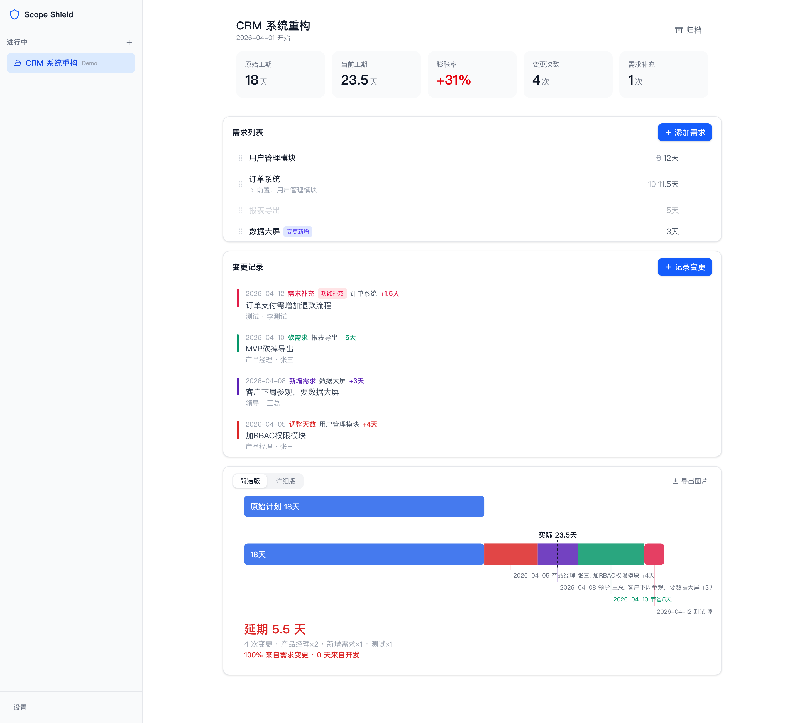
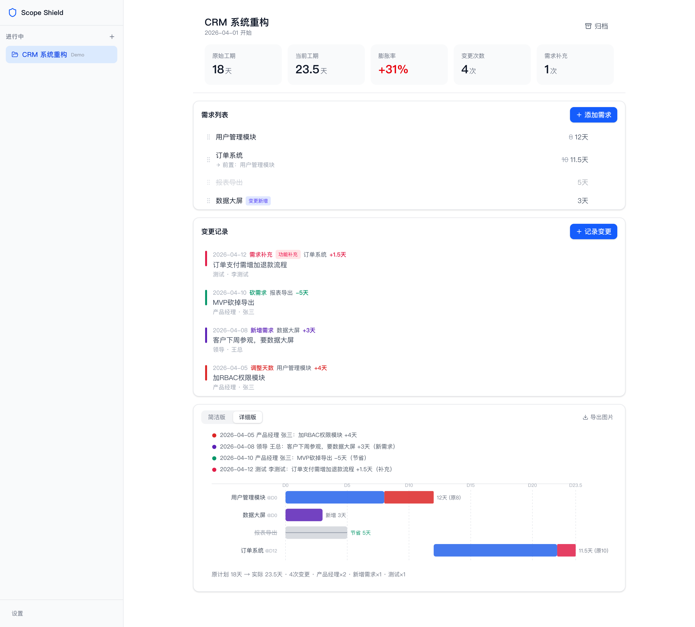
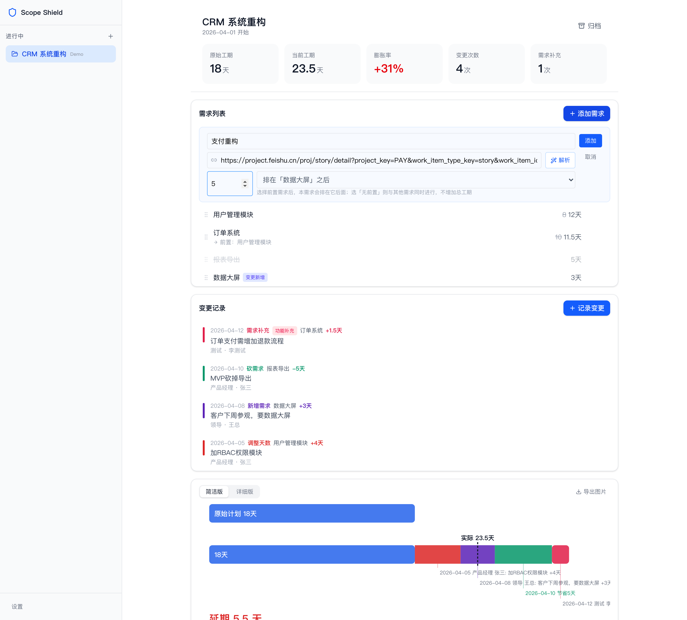
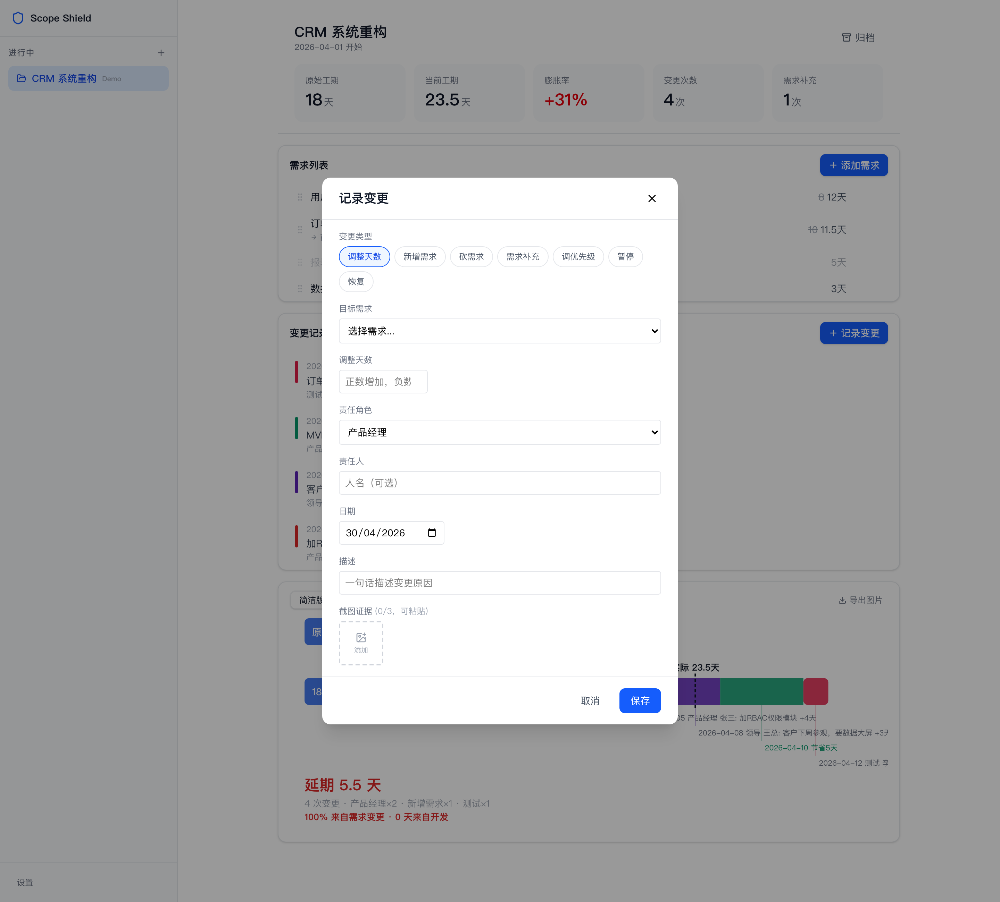
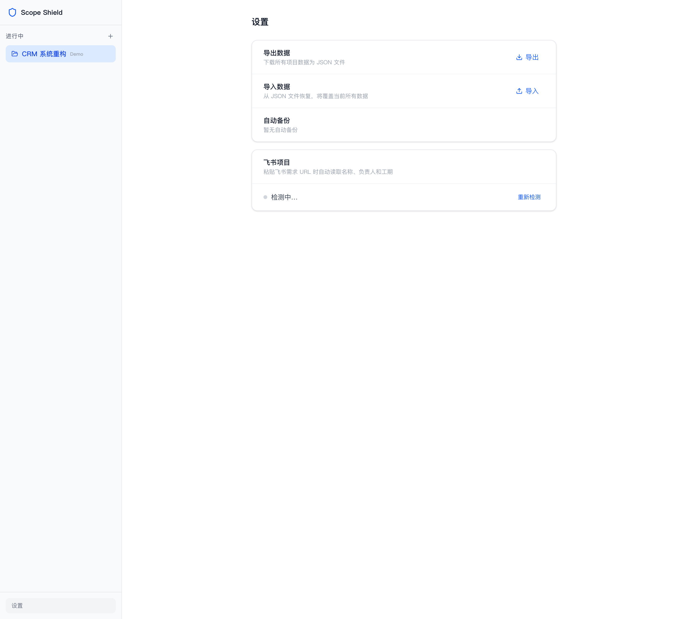
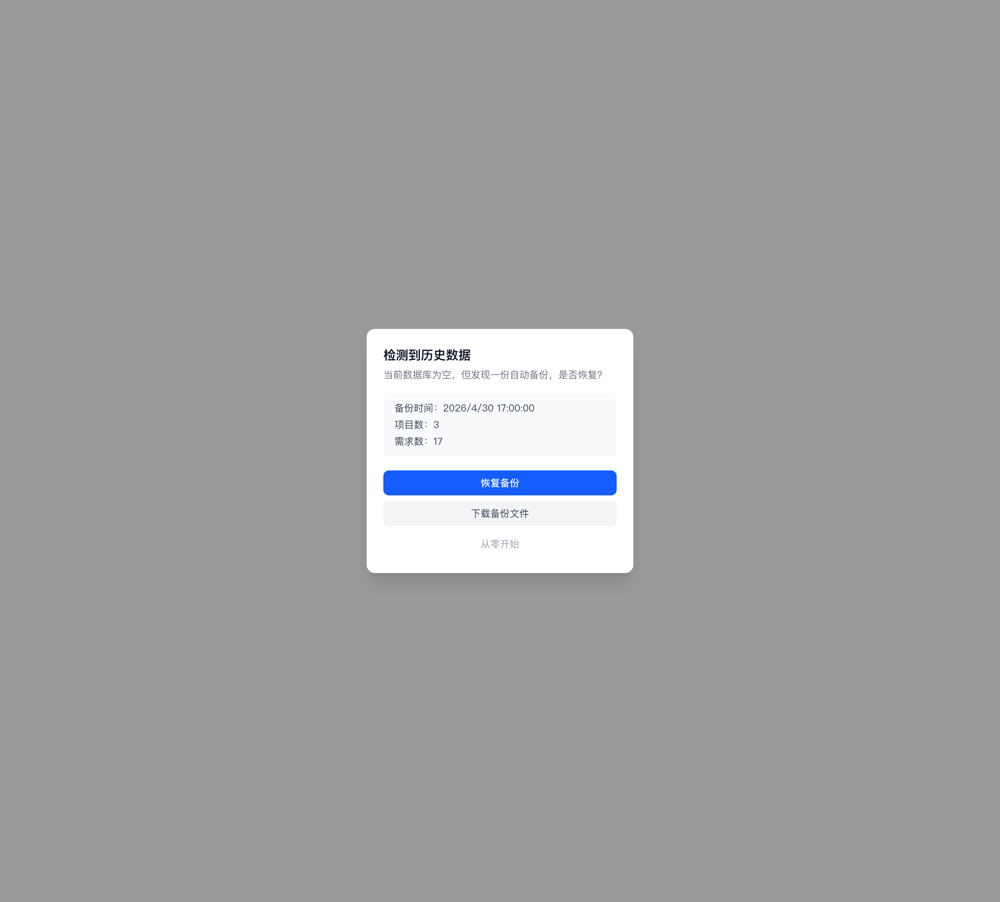
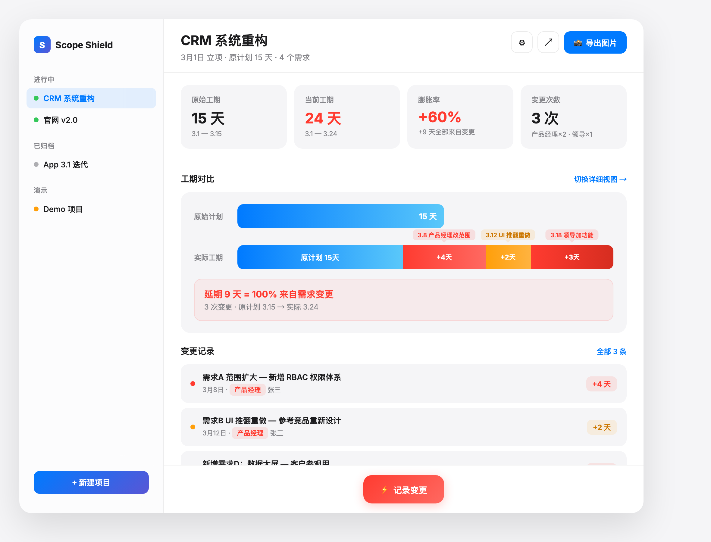

# 🛡️ Scope Shield

> **看见你项目里的范围蔓延** — 把每一次需求加 / 改 / 砍 / 重排都画成对比条 + 甘特时间线，让 scope creep 第一时间被人看见。
>
> 🔒 **零账号 · 零云同步 · 100% 本地 IndexedDB** — 你的项目数据，只存在你浏览器里。
>
> 一个**隐私优先**的项目范围膨胀可视化工具 — React 19 + Vite + IndexedDB 单页应用。

[](https://github.com/MrHulu/scope-shield)
[](LICENSE)
[](https://react.dev)
[](https://vitejs.dev)
[](https://tailwindcss.com)
[](e2e/)

---



> 这就是范围蔓延：原计划 **18 天** → 当前 **23.5 天**，膨胀 **31%**。每一次需求加 / 改 / 砍 / 重排都被记录、归因、可视化。

---

## 🤔 为什么需要 Scope Shield？

> **每次复盘都说"为啥这个项目延期了？"——但没人能说清，因为没人记录原计划是什么。**

| 维度 | Scope Shield | 传统项目管理 |
|------|--------------|--------------|
| **范围膨胀可视化** | ✅ 原计划 vs 现状对比条一目了然 | ⚠️ 只有当前快照，不知道偏多少 |
| **变更归因** | ✅ 7 类变更类型 + 截图证据 + 责任人 | ⚠️ 散落在聊天记录、邮件、群通知 |
| **数据所有权** | ✅ 100% 本地 IndexedDB | ⚠️ 云端 SaaS，搬走数据要导出 |
| **离线可用** | ✅ 完全离线工作 | ⚠️ 依赖网络与登录态 |
| **飞书集成** | ✅ 粘贴需求 URL 自动同步名字 / 工期 / 负责人 | ⚠️ 人工抄录 |
| **零静默丢失** | ✅ 自动备份 + 空库启动一键恢复 | ⚠️ 用户自己导出/手动备份 |

**如果你在意**：项目复盘要有据可查、不想把项目数据交给某个 SaaS 厂商、希望多个项目并行也能一眼看清谁在膨胀 —— **Scope Shield 是你的最佳选择**。

---

## ✨ 核心功能

### 🔄 7 种变更类型，覆盖项目漂移的所有形态

| 类型 | 场景 |
|------|------|
| `add_days` | "再给我加 2 天就好" |
| `new_requirement` | 临时插队的新需求 |
| `cancel_requirement` | 砍掉的需求（保留历史） |
| `supplement` | 同一需求的补充（功能加 / 条件改 / 细节细化 3 子型） |
| `reprioritize` | 优先级重排，不增减总量 |
| `pause` / `resume` | 暂停 + 恢复（保留剩余天数） |

### 📊 双图表视图

- **SimpleChart** — 原计划 vs 现状对比条，膨胀比例一眼看清
- **DetailChart** — 甘特时间线，含依赖关系 + 关键路径高亮

### 🔗 飞书项目 URL 一键同步

粘贴飞书需求 URL，自动拉取：需求名 / 工期 / 负责人 / 排期日期。支持 `feishu.cn` / `larksuite.com` / `meegle.com` 三域。代理失效时自动降级为 URL-only 模式，不影响录入。

### 🛡️ 数据持久化保障

- `navigator.storage.persist()` 阻止浏览器自动驱逐
- localStorage 自动备份（5 秒防抖、4 MB 上限、两级级联裁剪）
- 双 slot 滚动（`KEY_LATEST` + `KEY_PREV`）
- **空库启动检测**：发现备份自动弹恢复对话框，三选一（恢复 / 下载 / 跳过）
- IndexedDB DB_VERSION migration 框架，schema 可演进

### 🖱️ 流畅交互

- 拖拽排序（基于 `@dnd-kit`）
- 截图证据（每变更最多 3 张，base64 内嵌）
- 0.5 天最小工期粒度（半天精度）
- 依赖串行 / 并行调度

### 📤 导入导出

- JSON 全量导出 / 导入
- 自动备份独立下载
- modern-screenshot 出图分享

---

## 📸 应用截图

### 双图表视图

| 简洁版（对比条） | 详细版（甘特时间线） |
|:---:|:---:|
|  |  |
| 一眼看清原计划 vs 当前膨胀比例 | 需求级别的甘特时间线 + 变更标注 |

### 核心交互

| 添加需求（含飞书 URL） | 记录变更 |
|:---:|:---:|
|  |  |

### 数据保障

| 设置 / 自动备份状态 | 空库启动 · 一键恢复 |
|:---:|:---:|
|  |  |

### 设计概念稿（Apple 亮色磨砂玻璃）



> 视觉语言定位：磨砂玻璃侧边栏 + SF Pro + Apple 蓝/红 + 极简卡片。早期设计稿见 [`docs/prototypes/`](docs/prototypes/)。

---

## 🚀 快速开始

### 在线试用

打开 [https://github.com/MrHulu/scope-shield](https://github.com/MrHulu/scope-shield)，clone 到本地后 `npm run dev`。

> 应用是浏览器单页 SPA，**不需要安装**，`http://localhost:5173/` 即可开箱使用。

### 本地开发

```bash
git clone https://github.com/MrHulu/scope-shield.git
cd scope-shield
npm install

npm run dev          # → http://localhost:5173/
npm run build        # tsc -b && vite build
npm test             # vitest 单元测试
npm run test:e2e     # playwright 14 个 e2e spec
```

### 飞书代理（可选）

如果想用"粘贴飞书 URL 自动同步"功能，本地需要：

1. 装 [credential-center](https://github.com/MrHulu/credential-center)（或自建 `~/.credential-center/feishu_project_state.json`）
2. JSON 含 `cookies` 数组，至少一项的 `domain` 包含 `feishu.cn`
3. 包含 `meego_csrf_token` 的 cookie 项（用于 CSRF 校验）

代理只在 `npm run dev` 期生效；生产构建无代理时会自动降级为 URL-only 模式（仍可正常录入需求）。

---

## 🛠️ 技术栈

| 层级 | 选型 | 版本 |
|------|------|------|
| **运行时** | React | 19.2 |
| **类型** | TypeScript | ~6.0 |
| **构建** | Vite | 8.0 |
| **样式** | Tailwind CSS | v4.2 |
| **状态管理** | Zustand | 5.0 |
| **路由** | react-router-dom | 7.14 |
| **持久化** | idb (IndexedDB wrapper) | 8.0 |
| **拖拽** | @dnd-kit | 6.3 |
| **时间** | date-fns | 4.1 |
| **截图** | modern-screenshot | 4.6 |
| **图标** | lucide-react | 1.8 |
| **单测** | Vitest | 4.1 |
| **E2E** | Playwright | 1.58 |

---

## 📁 项目结构

```
scope-shield/
├── src/
│   ├── App.tsx                 # 启动 → persist + 空库检测 + RecoveryDialog
│   ├── pages/
│   │   ├── ProjectPage.tsx     # 主项目页
│   │   └── SettingsPage.tsx    # 导入导出 + 备份状态 + 飞书代理状态
│   ├── components/
│   │   ├── chart/              # SimpleChart / DetailChart / ExportModal
│   │   ├── change/             # ChangeList / ChangeModal / ChangeRow
│   │   ├── requirement/        # RequirementForm (含飞书 URL 输入)
│   │   └── shared/             # RecoveryDialog / Toast / ConfirmDialog
│   ├── engine/                 # changeProcessor / replayEngine / scheduler
│   ├── db/                     # connection + 6 repo + autoBackup + changeNotifier
│   ├── services/               # feishuRequirement / feishuSettings
│   ├── stores/                 # zustand: project / requirement / change / ui
│   ├── hooks/                  # useChanges / Schedule / SyncFeishu / Export ...
│   └── types/index.ts
├── e2e/                        # 14 个 Playwright spec + helpers
└── docs/
    ├── mvp-prd.md              # 产品需求
    ├── architecture.md         # 架构设计
    ├── data-model.md           # 数据模型
    ├── flows.md                # 用户流
    ├── ui-spec.md              # UI 规范
    ├── acceptance.md           # 验收标准
    ├── data-durability-design.md          # 持久化设计
    └── vnext-feishu-url-requirement-design.md
```

---

## 🧪 测试

```bash
npm test                # vitest run（单元）
npm run test:watch
npm run test:e2e        # playwright 14 specs（端到端）
```

单元测试 163 个（vitest）+ E2E 67 个（playwright）。E2E 覆盖：7 个变更类型 / chart-export / dnd-reorder / gantt-after-reorder / project CRUD / requirement / requirement-feishu-url / auto-backup / recovery-dialog / screenshot / settings-import-export。

```bash
CAPTURE_SCREENSHOTS=1 npm run test:e2e -- e2e/_screenshots.spec.ts  # 重新生成 README 截图
```

---

## 🔒 隐私承诺

| 承诺 | 实现 |
|------|------|
| 零遥测 | 不发任何 analytics / metric / crash |
| 零追踪 | 不调任何第三方追踪 SDK |
| 零账号 | 不需要注册登录 |
| 数据本地 | 全量在浏览器 IndexedDB + localStorage |
| 飞书凭证 | dev 期从 `~/.credential-center/` 读，**永不入仓** |

---

## 🤝 贡献

欢迎提交 Issue 和 Pull Request！

1. Fork 本仓库
2. 创建分支 `git checkout -b feature/xxx`
3. 提交 `git commit -m 'feat: xxx'`
4. 推送 `git push origin feature/xxx`
5. 开 Pull Request

> 项目治理细节见 [HANDOFF.md](HANDOFF.md)（架构、未做、维护契约）。

---

## 📄 许可证

[MIT License](LICENSE)

---

<p align="center">
  <sub>🛡️ Scope Shield — 让范围蔓延肉眼可见。</sub>
</p>

<p align="center">
  <a href="https://github.com/MrHulu/scope-shield/issues">反馈</a> ·
  <a href="https://github.com/MrHulu/scope-shield/stargazers">Star ⭐</a> ·
  <a href="HANDOFF.md">项目档案</a>
</p>
