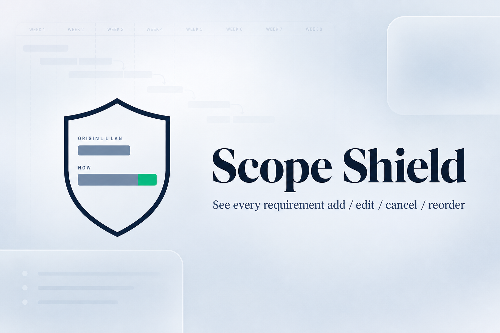
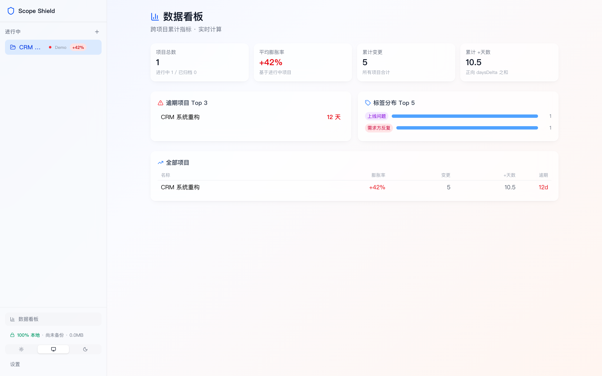
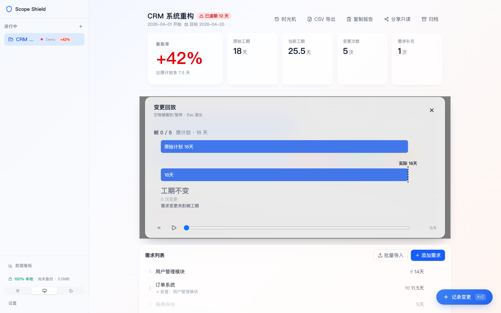
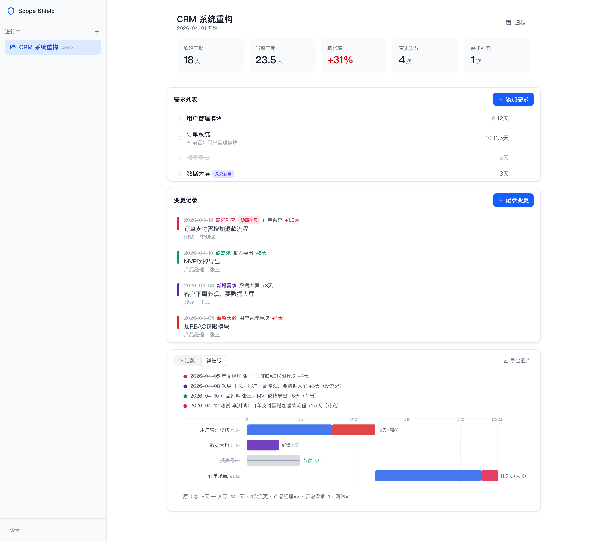
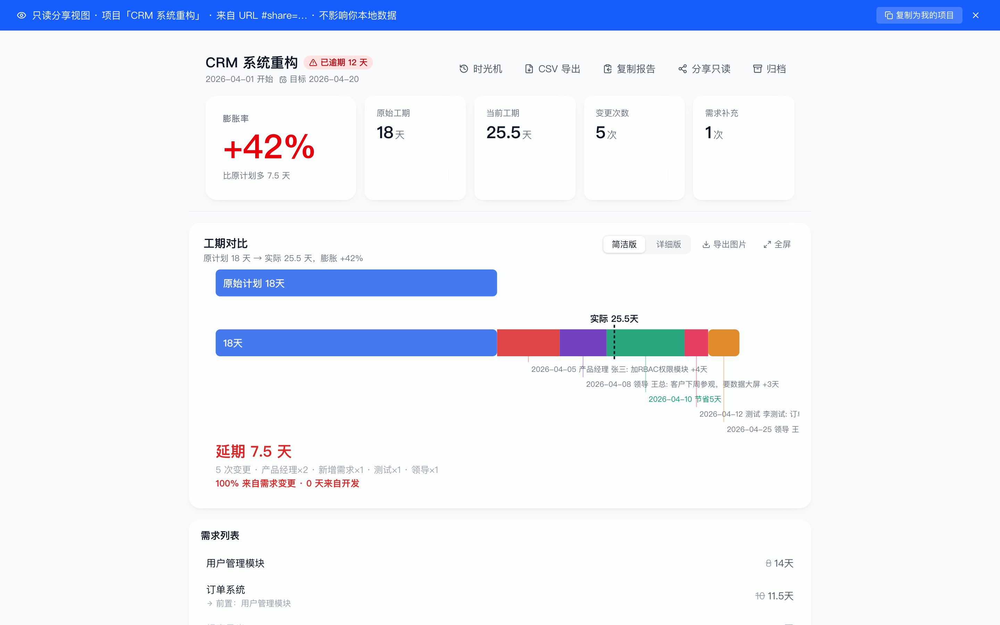

<div align="center">



# 🛡️ Scope Shield

### 让每一次需求加 / 改 / 砍 / 重排都肉眼可见

**100% 本地、零账号、零云同步的项目范围膨胀可视化工具**

[](https://github.com/MrHulu/scope-shield/stargazers)
[](LICENSE)
[](src)
[](https://react.dev)
[](https://vitejs.dev)

[**English**](#english) · [**功能**](#-核心能力) · [**快速开始**](#-30-秒开跑) · [**路线图**](#%EF%B8%8F-roadmap)

</div>

---

> **每次复盘都问"为啥这个项目延期了？"——但没人能说清，因为没人记录原计划是什么。**

Scope Shield 把项目从立项到交付的每一次需求加 / 改 / 砍 / 重排，都画成**原计划 vs 现状对比条 + 甘特时间线**，让 scope creep 第一时间被人看见。所有数据 100% 本地，没有 SaaS 卖你订阅、没有云端读你项目、没有 analytics 上报。一个浏览器标签 + 一个 IndexedDB，就是全部。

**为什么不是 Notion / Jira / Linear？** 它们只显示当前快照，看不到原始基线，看不到漂移过程。Scope Shield 把"原计划"作为一等公民，每一次变更都留痕、可回放、可分享、可跨项目聚合 —— 而且不绑账号、不上云、永久免费开源。

---

## ✨ 核心能力

### 📊 跨项目数据看板



5 个项目并行管理时，平均膨胀率、逾期 Top、标签 Top 5 一眼看清。这是 Wave 5 把工具升级为平台的关键能力 —— 多数 SaaS 同行只在付费版才解锁。

### ⏯️ 变更回放：把项目漂移做成动画



时间轴拖动 / 自动播放 / 空格暂停 / Esc 退出。每一次变更后的工期变化都能"倒带"重看，复盘会议神器。

### 📈 双图表视图：从一眼看清到深入分析



简洁版（对比条）让原计划 vs 当前膨胀比例一目了然；详细版（甘特图）展开到需求级，含变更标注 + 关键路径高亮。

### 🔗 只读分享链接：0 后端协作



把当前项目状态序列化进 URL fragment（`#share=…`），对方打开就看到一样的视图。一键"复制为我的项目"还能 fork 走本地编辑。**真正的 zero-backend 协作。**

### 🎁 还有

- **7 种变更类型** — `add_days` / `new_requirement` / `cancel` / `supplement` / `reprioritize` / `pause` / `resume`
- **变更标签 + 跨项目聚合** — 5 预设 + 自定义，老板汇报刚需
- **5 个项目模板** — 移动 App 0→1 / SaaS Dashboard / 内部工具 / 数据看板 / 电商后台
- **暗色模式 + 全键盘可达** — `?` 帮助 / `⌘K` 命令面板 / `c` 记录变更 / `g s` `g d` 跳转
- **移动端响应式** — 390×844 不破首屏，出门也能 review
- **飞书 URL 一键同步 + 批量导入** — 粘贴 N 条需求 URL 自动拉取名 / 工期 / 负责人

---

## 🚀 30 秒开跑

```bash
git clone https://github.com/MrHulu/scope-shield.git
cd scope-shield && npm install && npm run dev
# → http://localhost:5173/
```

零依赖部署：浏览器 SPA，不需要数据库、不需要后端、不需要登录。打开就用。

> 想用飞书 URL 一键同步？装 [credential-center](https://github.com/MrHulu/credential-center) 或自建 `~/.credential-center/feishu_project_state.json`（含 `cookies` + `meego_csrf_token`）。仅 dev 期生效，生产构建无代理时自动降级 URL-only。

---

## 🗺️ Roadmap

每一波结束都有秘书亲测走查（headless Chromium + Playwright）+ 公开报告，详见 [`.review/`](.review/)。

| Wave | 主题 | 落地项 | 走查 |
|:---:|---|:---:|:---:|
| **W1** | 商业级 baseline | 14 项 | 14/14 ✅ |
| **W2** | UX 深化 + a11y | 11 项 | 14/14 ✅ |
| **W3** | 力量用户 + 时光机 | 9 项 | 13/13 ✅ |
| **W4** | 数据生命周期 + 协作 | 9 项 | 17/17 ✅ |
| **W5** | 跨项目平台 | 6 项 | 19/19 ✅ |
| **W6** | 录入加速 (进行中) | 1+ 项 | — |

**累计**：45+ 项功能 · 276 unit + e2e 测试 · 5 轮亲测走查全过。

下一波候选：国际化 / Analytics 时间线 / Share URL lz-string 压缩 / Onboarding tour / PDF 导出。
[开 Issue](https://github.com/MrHulu/scope-shield/issues) 或直接 PR 决定优先级。

---

## 🛠️ 技术栈

React 19 · TypeScript · Vite 8 · Tailwind v4 · Zustand 5 · react-router-dom 7 · idb (IndexedDB) · @dnd-kit · lucide-react · Vitest 4 + Playwright 1.58.

详细架构 / 维护契约 / 已知未做见 [HANDOFF.md](HANDOFF.md)。

---

## 🔒 隐私承诺

🚫 零遥测 · 🚫 零追踪 · 🚫 零账号 · ✅ 数据全量在浏览器 IndexedDB + localStorage · ✅ 飞书凭证从 `~/.credential-center/` 读，**永不入仓**

数据保障：`navigator.storage.persist()` 阻止浏览器驱逐 + 5s 防抖 4MB localStorage 双 slot 备份 + 空库启动检测一键恢复 + JSON/CSV 全量导入导出 + IndexedDB schema migration 框架。

---

<a id="english"></a>

## English (TL;DR)

**Scope Shield** is a 100% local, account-free, zero-cloud project scope-creep visualization tool. Every requirement add / edit / cancel / re-prioritize is recorded against the original baseline and rendered as comparison bars + Gantt timeline + replay animation. All data lives in your browser's IndexedDB — no backend, no SaaS, no telemetry.

**Highlights**: cross-project analytics dashboard · zero-backend share links via URL fragments · 7 change types · keyboard-first UX · auto-backup with one-click recovery · Feishu Project URL sync + bulk import · dark mode · mobile responsive · 5 project templates · 276 unit tests + Playwright e2e + 5 hand-tested walkthroughs.

```bash
git clone https://github.com/MrHulu/scope-shield.git
cd scope-shield && npm install && npm run dev
```

Stack: **React 19 · Vite 8 · Tailwind v4 · Zustand 5 · IndexedDB · TypeScript**.

---

## 📄 License

[MIT](LICENSE) — fork it, ship it, sell it (just keep the notice).

---

<div align="center">


### 喜欢的话点个 ⭐ 让更多人看到 ❤️

[](https://star-history.com/#MrHulu/scope-shield&Date)

<sub>🛡️ Scope Shield — built with care, shipped with discipline.</sub>

[Issues](https://github.com/MrHulu/scope-shield/issues) · [Discussions](https://github.com/MrHulu/scope-shield/discussions) · [Star ⭐](https://github.com/MrHulu/scope-shield/stargazers)

</div>
